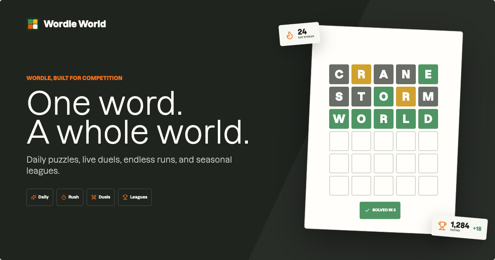

# Wordle World

Wordle World is a full-stack, server-authoritative word game built with Base44, React, and Vite. It starts with the familiar daily word puzzle and expands it into endless runs, timed challenges, head-to-head battles, player progression, seasonal leagues, and tournaments.

This repository is intended to be useful as both a playable game and a Base44 template. It demonstrates how to combine a responsive React game interface with protected answers, backend validation, realtime multiplayer state, persistent progression, virtual currency, quests, leaderboards, and account management.



Live app: [https://wordle-world.base44.app](https://wordle-world.base44.app)

## Copy This Template To Your Base44 Workspace

1. [Create a Base44 account](https://b44.wix.wf/) or sign in. This is an affiliate link; using it may support the template author at no additional cost to you.
2. Switch to the Base44 workspace where you want your copy of Wordle World to live.
3. Open **App Templates**, find **Wordle World**, and click **View details**.
4. Click **Use Template**. Base44 creates an independent copy in your workspace, so changes to your app will not affect the original template.
5. Rename the new app, open it in the Builder, and customize its content, design, game rules, and data for your project.
6. Review the app settings and security checks, then publish when you are ready.

Wordle World uses backend functions, so the destination workspace needs a Base44 Builder plan or higher. Secrets and third-party connections do not transfer with templates; configure your own values after copying. See Base44's [app template guide](https://docs.base44.com/Getting-Started/App-templates) for the current marketplace workflow.

## What Is Included

### Game modes

- **Daily Challenge**: one shared puzzle per day with guest play and saved progress.
- **Endless Run**: continuous word rounds for XP, tokens, and longer sessions.
- **Time Rush**: solve as many words as possible before the timer expires.
- **Rival Battles**: ranked matchmaking, private invite codes, presence tracking, forfeits, and bot fallback.
- **Season League**: division standings, league points, seasonal enrollment, and a cup tournament for qualifying players.

### Player systems

- Optional authentication: guests can play the Daily Challenge before registering.
- Persistent profiles, handles, avatars, levels, statistics, and achievements.
- XP, daily streaks, streak shields, tokens, and a transaction ledger.
- Daily quests with progress, rewards, claims, and rerolls.
- Inventory items, utilities, and unlockable cosmetics.
- Ranked ratings, public leaderboards, divisions, and cup brackets.
- Account deletion and legacy progress import.

### Template and promotional tools

- Responsive desktop and mobile game UI.
- Sound, haptics, hard mode, contrast, and reduced-motion preferences.
- PWA manifest, icons, Open Graph metadata, and a social share image.
- An unlinked `/promo-capture` studio with downloadable promotional artwork.

## How The App Works

The browser never receives a puzzle answer before a round is complete. Starting a game, validating a guess, settling rewards, updating a streak, changing a rating, and progressing a tournament all happen in Base44 backend functions.

```text
React UI
  |
  | Base44 SDK function calls
  v
Game, duel, economy, quest, and tournament functions
  |
  | service-role entity access
  v
Base44 entities with row-level security
```

This separation is the main architectural idea in the template:

- Public or player-owned data is exposed through entity row-level security.
- Sensitive puzzle answers live in `PuzzleSecret` and are admin-only.
- Mutating game operations run through backend functions instead of direct client writes.
- Idempotency keys and version fields protect rewards and concurrent game actions.
- Realtime entity subscriptions refresh player progression and multiplayer state.

## Technology

| Layer | Technology |
| --- | --- |
| Frontend | React 18, Vite, React Router |
| Backend | Base44 functions running on Deno |
| Data | Base44 entities with row-level security |
| Client data | Base44 SDK, TanStack Query |
| UI | Radix primitives, Lucide icons, custom CSS |
| Motion | Framer Motion, Canvas Confetti |
| Validation | Server-side game and domain services |
| Testing | Node test runner, ESLint, TypeScript, Deno checks |

## Project Structure

```text
.
|-- base44/
|   |-- config.jsonc              # Base44 app and site configuration
|   |-- entities/                 # Persistent data schemas and RLS rules
|   |-- functions/                # HTTP backend function entry points
|   `-- shared/                   # Shared game, duel, season, and platform logic
|-- public/                       # Icons, manifest, fonts, and social image
|-- scripts/                      # Production audit scripts
|-- src/
|   |-- api/                      # Base44 client and typed API wrappers
|   |-- components/wordle/        # Classic Wordle UI
|   |-- components/world/         # World modes, HUD, drawers, and game shell
|   |-- lib/wordle/               # Client game helpers, words, audio, and storage
|   |-- pages/                    # App, authentication, and capture pages
|   `-- App.jsx                   # Route definitions
|-- index.html                    # HTML shell and social metadata
|-- package.json                  # Development and verification commands
`-- vite.config.js                # Vite and Base44 plugin configuration
```

## Base44 Resources

### Entity groups

| Domain | Entities |
| --- | --- |
| Games | `GameSession`, `GuessAttempt`, `PuzzleSecret` |
| Players | `PlayerAccount`, `PlayerProfile`, `PlayerInventory`, `AchievementUnlock` |
| Economy and quests | `WalletTransaction`, `PlayerQuest` |
| Battles | `DuelMatch`, `DuelParticipant`, `DuelBotState` |
| Seasons | `Season`, `LeagueMembership`, `LeaderboardEntry`, `CupBracket` |
| Compatibility | `WordlePlayerState`, `User` |

Entity definitions are in [`base44/entities`](base44/entities). Read the `rls` block in each schema before changing frontend access patterns.

### Backend function groups

| Group | Responsibilities |
| --- | --- |
| `game` | Bootstrap, start, guess, status, guest claims, and extra guesses |
| `duel` | Ranked queue, private battles, status, presence, current match, and forfeits |
| `economy` | Purchases and inventory settlement |
| `quests` | Claiming and rerolling quests |
| `profile` | Safe profile and handle updates |
| `tournament` | Enrollment, status, and cup check-in |
| `account` | Account deletion |
| `legacy` | Importing older player progress |

Function entry points live in [`base44/functions`](base44/functions). Shared domain logic belongs in [`base44/shared`](base44/shared) so it can be tested without duplicating rules across endpoints.

## Getting Started

### Prerequisites

- Node.js 20 or newer
- npm
- A Base44 account and access to a Base44 app

Install dependencies:

```bash
npm install
```

Run the Base44 CLI through `npx`; a global installation is not required.

Check authentication before using Base44 CLI commands:

```bash
npx base44 whoami
```

If needed, authenticate manually:

```bash
npx base44 login
```

### Run the full Base44 development environment

```bash
npx base44 dev
```

The project config includes `site.serveCommand`, so Base44 starts the local backend and the Vite frontend together. Open the frontend URL printed by the command.

### Run only the frontend

Use this workflow when the UI should call an already deployed Base44 backend:

```bash
npm run dev
```

Create `.env.local` with the app values for your own Base44 copy:

```bash
VITE_BASE44_APP_ID=your_app_id
VITE_BASE44_APP_BASE_URL=https://your-app.base44.app
```

Never commit `.env.local` or credentials.

## Routes

| Route | Purpose |
| --- | --- |
| `/` | Redirects to the default Daily Challenge |
| `/play/daily` | Daily Challenge |
| `/play/endless` | Endless Run |
| `/play/rush` | Time Rush |
| `/play/duel` | Rival Battles |
| `/play/league` | Season League |
| `/player/:panel` | Missions, shop, profile, and settings panels |
| `/login`, `/register` | Authentication flows |
| `/promo-capture` | Unlinked promotional image export studio |

## Common Customizations

### Change the word lists or game rules

- Curated answer seed and exclusions: `data/word-lists/`
- Generated client and server word lists: `src/lib/wordle/words.js` and `base44/shared/words.js`
- Word-list generator: `scripts/generate-word-lists.mjs`
- Server evaluation and session rules: `base44/shared/session-service.js`
- Game endpoints: `base44/functions/game/`

Run `npm run words:generate` after changing the seed or exclusions. The generator preserves the curated schedule, extends it with common SCOWL words ranked by SUBTLEX-US frequency, and builds the full accepted-guess set from `word-list`. `npm test` checks that the generated frontend and backend modules remain synchronized.

Keep answer validation and reward rules on the server. Client-only checks should be treated as interaction feedback, not authority.

### Change rewards, levels, or shop items

- Player and wallet rules: `base44/shared/platform.js`
- Shop presentation: `src/components/world/WordleWorld.jsx`
- Purchase endpoint: `base44/functions/economy/purchase/entry.ts`

When changing currency logic, preserve transaction records and idempotent operation keys.

### Change duel or league behavior

- Duel logic: `base44/shared/duel-service.js`
- Season and tournament logic: `base44/shared/season-service.js`
- Duel endpoints: `base44/functions/duel/`
- Tournament endpoints: `base44/functions/tournament/`

### Change the visual identity

- Global tokens and fonts: `src/index.css`
- World game styling: `src/components/world/world.css`
- Icons and PWA assets: `public/icons/` and `public/manifest.json`
- Social card source: `/promo-capture`
- Published social image: `public/wordle-world-social.png`
- Social metadata: `index.html`

After changing the social artwork, download the new 1200 x 630 image from the capture studio and replace `public/wordle-world-social.png`.

## Verification

Run the relevant checks before publishing:

```bash
npm test
npm run lint
npm run typecheck
npm run build
npm run audit:production
```

The frontend checks use ESLint and TypeScript. Backend linting and type checks use Deno. The production audit checks the repository for configuration and delivery issues that are easy to miss during local development.

## Publishing

For a GitHub-connected Base44 app:

1. Commit and push the repository changes.
2. Open the Base44 dashboard:

   ```bash
   npx base44 dashboard open
   ```

3. Review the synced changes and publish the app from the dashboard.

To deploy all local Base44 resources and the site through the CLI:

```bash
npm run build
npx base44 deploy -y
```

Do not deploy only the frontend after changing entity schemas or backend functions. Keep the site and Base44 resources on compatible versions.

## Security Notes

- Never expose `PuzzleSecret` or service-role access to the browser.
- Keep all reward, wallet, rating, and tournament mutations in backend functions.
- Review entity row-level security whenever adding a field or a new access path.
- Treat client-provided scores, timestamps, rewards, and ownership fields as untrusted.
- Keep credentials in local environment variables or Base44 secrets, never in source control.

## Documentation

- [Base44 CLI overview](https://docs.base44.com/developers/references/cli/get-started/overview.md)
- [Base44 agent skills](https://docs.base44.com/developers/backend/overview/skills.md)
- [Base44 GitHub integration](https://docs.base44.com/Integrations/Using-GitHub)
- [Base44 support](https://app.base44.com/support)

## License And Branding

Before distributing a derivative template, replace the Wordle World name, icons, social artwork, and hosted app URL with your own brand. Add the license terms appropriate for your project or marketplace listing.
